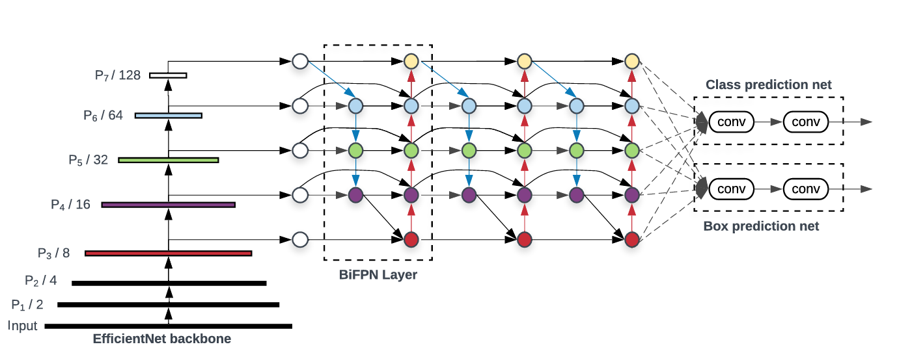

# EfficientDet-Object-Detection-Implementation-with-Tensorflow
EfficientDet is a scalable and high-performance object detection framework that systematically balances accuracy and computational efficiency through careful architectural design. It uses EfficientNet as the backbone for feature extraction, BiFPN for enhanced multi-scale feature fusion, and a shared network for classification and box regression. This project implements the core components introduced in the research paper *"EfficientDet: Scalable and Efficient Object Detection"* by Mingxing Tan, Ruoming Pang, and Quoc V. Le from Google Research. You can access the full paper [here](https://arxiv.org/abs/1911.09070)

## 📚 Table of Contents

- [Overview](#overview)
- [BiFPN (Bidirectional Feature Pyramid Network)](#bifpn-bidirectional-feature-pyramid-network)
- [Key Components](#key-components)
- [Code Organization](#code-organization)
- [Usage](#usage)
- [Prerequisites](#prerequisites)
- [References](#references)

---

## 🔍 Overview

EfficientDet is a family of scalable and efficient object detection models built on the EfficientNet backbone. This project implements EfficientDet from scratch using TensorFlow, aiming to provide a high-performance and lightweight solution for object detection.

**Key Features:**

- Scalable architecture suitable for edge and server environments.
- BiFPN for robust multi-scale feature fusion.
- EfficientNet backbone for high accuracy with fewer parameters.
- Support for COCO-style datasets and evaluation.

---

## 🔁 BiFPN (Bidirectional Feature Pyramid Network)

BiFPN is an enhanced feature fusion architecture that forms a critical part of EfficientDet. It improves upon the traditional FPN by enabling:

- 🔁 **Bidirectional Information Flow**: Top-down and bottom-up paths allow richer feature propagation.
- 🔗 **Cross-Scale Connections**: Features from different levels are directly connected.
- ⚖️ **Learnable Weighted Feature Fusion**: Automatically learns the importance of input features.
- 🔁 **Repeated Fusion Layers**: Enhances learning across multiple stages.

### Architecture Overview

1. Feature maps at various scales (P3–P7) are extracted from the EfficientNet backbone.
2. These maps are fused through multiple BiFPN layers.
3. Final fused features are passed to the classification and regression heads.

### Benefits

- ✅ Higher accuracy with fewer computations.
- 🔄 Seamless scaling across model sizes (EfficientDet-D0 to D7).
- 🧠 Learns optimal paths for feature fusion during training.

 <!-- Replace with actual image -->

---

## 🧩 Key Components

- **EfficientNet Backbone**: Extracts deep features while maintaining a good balance of FLOPs and accuracy.
- **BiFPN**: Enhances multi-scale fusion with learnable attention.
- **Classification and Box Regression Heads**: Predict object classes and bounding boxes.
- **Loss Functions**:
  - **Focal Loss**: Deals with class imbalance.
  - **Smooth L1 or IoU Loss**: For bounding box regression.

---

## 🗂 Code Organization
The project is organized into several key files and directories:
- `efficientdet.py`: Contains the main implementation of the EfficientDet model, including the architecture and forward pass logic.
- `dataset.py`: Handles data loading and preprocessing, including the COCO dataset integration.
- `loss_function.py`: Implements the loss functions used during training, including the Focal Loss.
- `utils.py`: Contains utility functions and classes for bounding box transformations and anchor generation.
- `train.py`: Script for training the model, including data pipeline setup and training loop.
- `test.py`: Script for evaluating the model on test data and generating predictions.
- `eval.py`: Contains functions for evaluating the model's performance using COCO metrics.

## Usage
To use the EfficientDet model, follow these steps:
1. Clone the repository to your local machine.
2. Install the required dependencies
3. Prepare your dataset in the COCO format.
4. Run the training script with your desired parameters:
   ```bash
   python train.py --data_path <path_to_your_data> --num_epochs <number_of_epochs>
5. After training, use the test script to evaluate the model:
   ```bash
   python test.py --pretrained_model <path_to_trained_model>

## Prerequisites
Ensure that you have all the necessary libraries installed before running the scripts:

1. Python 3.6 or higher
2. TensorFlow 2.x
3. NumPy
4. OpenCV
5. COCO API (pycocotools)
